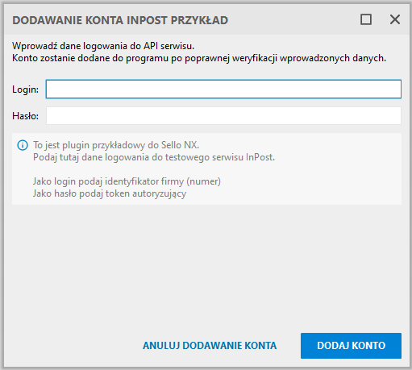
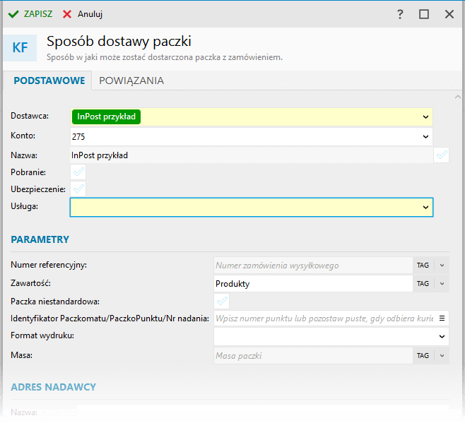
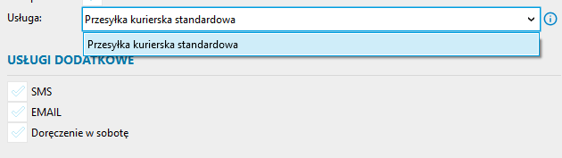
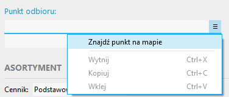

# Jak stworzyć własny plugin kurierski dla Sello NX?

Tutorial zakłada, że Visual Studio oraz NexoSDK w odpowiedniej wersji są zainstalowane w systemie. 
Cały kod opisywanego tutaj rozwiązania jest dostępny w folderze [InPostPrzyklad](InPostPrzyklad/README.md). Informacje dotyczące tworzenia oraz instalacji rozszerzenia nexo w bardziej szczegółowej postaci dostępne są w pliku **InsERT.nexo.Sfera.chm** w rozpakowanym folderze z nexoSDK.

# Przygotowanie środowiska

## Generowanie projektu plugina z szablonu Visual Studio

1. W Visual Studio dodajemy nowy projekt i wybieramy szablon **Sfera - rozszerzenie**
2. W kolejnym oknie podajemy nazwę projektu, np. **InPostPrzyklad**, ewentualnie określamy lokalizację, w której projekt zostanie zapisany na dysku.
3. W kolejnym oknie należy wskazać lokalizację folderu /Bin z nexoSDK zainstalowanego wcześniej.
4. Wskazanie poprawnej lokalizacji pozwoli wybrać typ rozszerzenia nexo, jakie ma zostać utworzone i wybieramy tutaj **IIntegracjaKuriera**. Jako nazwę rozszerzenia podajemy nazwę serwisu kurierskiego, tutaj. **InPostPrzyklad**.
5. Po przejściu dalej zostanie wygenerowany kod plugina integracji kurierskiej, nad którym dalej będziemy pracować.

## Struktura plików

Po stworzeniu projektu z szablonu pojawi się następująca struktura plików (pominięte zostały pliki i foldery związane z projektami w C#)

> - **InPostPrzyklad/**
>    - **DostawcaPluginow.cs** - tutaj można określić autora plugina
>    - **InPostPrzyklad.cs** - główny kod plugina
>    - **InPostPrzyklad.plugin** 
>    - **Konfiguracja.xml** - konfiguracja rozszerzenia, tutaj można włączyć automatyczną instalację plugina w bazie testowej po zbudowaniu go w Visul Studio
>    - **ParametryInstalacji.txt** - dane dostępowe do bazy testowej nexo

## Pierwsza kompilacja

Po wybraniu w Visual Studio opcji Build tak utworzony projekt powinien się skompilować i utworzyć pakiet zawierający rozszerzenie do systemu nexo oraz instalator w postaci pliku uruchamialnego exe.

Pakiet można wgrać do bazy nexo poprzez program serwisowy lub też uruchamiając instalator i wskazując bazę danych, w której rozszerzenie ma zostać zainstalowane.

Na nasze potrzeby przyda się jednak opcja automatycznego instalowania plugina w bazie testowej, wykonywana podczas budowania projektu w Visual Studio.

## Automatyczna instalacja plugina w bazie testowej Sello NX

W pliku **ParametryInstalacji.txt** należy wskazać dane dostępowe do bazy testowej.

```
Serwer=(local)
UwierzytelnianieWindows=Tak
#Uzytkownik=
#Haslo=
BazaDanych=Nexo_Baza_testowa_SelloNX
``` 

Następnie w pliku **Konfiguracja.xml** należy odkomentować linię:

```xml
  <ParametryInstalacji StworzPlikiBat="Tak" AutomatycznaInstalacja="Tak">
    <PlikParametrowInstalacji>..\..\..\..\ParametryInstalacji.txt</PlikParametrowInstalacji>
  </ParametryInstalacji>
```
upewniając się, że atrybut **AutomatycznaInstalacja** jest ustawiony na Tak. Uruchamiając budowanie projektu na samym końcu w oknie Output pojawią się nowe wpisy, informujące o instalacji/aktualizacji rozszerzenia w bazie testowej.

```
Uruchamianie "Zainstaluj_Aktualizuj" w celu instalacji/aktualizacji pakietu.
```

W tym momencie środowisko jest przygotowane do rozpoczęcia prac nad właściwą integracją.


# Podstawowa konfiguracja plugina

## Warstwa infrastrukturalna
Każdy plugin w nexo jest identyfikowany unikalnym identyfikatorem, który jest automatycznie generowany przez szablon Visual Studio. Jeśli kod plugina został pobrany/skopiowany **należy wygenerować nowy GUID identyfikujący plugin** i zapisać go w polu:


```C#
 public Guid Identyfikator => new Guid("XXXXXXXX-XXXX-XXXX-XXXX-XXXXXXXXXXXX"); // Wstawić unikalny GUID dla nowej integracji
```

 Podaj wersję plugina. W przyszłości będzie ona wykorzystywana do powiadamiania użytkownika o pojawieniu się nowej wersji, jeśli taką przygotujesz.

 ```C#
 public int Wersja => 1;
 ```

## Warstwa wizualna
Istotne jest, aby pluginy stanowiły spójną całość z Sello NX od strony wizualnej, dlatego warto poświęcić tutaj chwilę czasu, aby Twoje rozwiązanie pasowało do programu i było kolorystycznie poprawne z tym, co użytkownicy znają z życia codziennego.


Podaj nazwę plugina, będącą zarazem nazwą integracji. Podaj tutaj nazwę firmy kurierskiej, z którą plugin współpracuje. Nazwa ta wyświetlana jest użytkownikowi w postaci kolorowej etykietki identyfikującej dostawcę paczek. Zadbaj o to, aby nazwa była krótka a wielkość liter odpowiadała realnej nazwie jaką stosuje firma kurierska.
Dobre nazwy to: DPD, InPost, Poczta Polska, Pocztex, DHL, itp.

```C#
public string Nazwa => "InPost przykład";
```

Dalej krótki opis plugina, który będzie widoczny dla Użytkownika programu.

```C#
public string Opis => "Przykładowa integracja kurierska z testowym serwisem InPost API ShipX";
```

Uzupełniamy także trzyliterowy symbol integracji, widoczny w module konta integracji, wykorzystywany w module numeracja w nexo jako składnik numeru. Zadbaj o to, aby symbol ten kojarzył się z firmą kurierską. Dobre nazwy to: DPD, INP (InPost), PPL (Poczta Polska), PCX (Pocztex), DHL itp.

```C#
 public string Symbol => "INP";
 ```

Zamiast graficznych logotypów integracji, które wymagałyby przygotowania odpowiednich grafik, Sello NX identyfikuje wizualnie integracje poprzez odpowiednie etykietki, dzięki czemu użytkownik szybciej rozpozna jakiej integracji dotyczy sposób wysyłki paczki. Służą do tego dwie wartości określające kolorystykę, które wraz z nazwą integracji tworzą kolorową etykietkę.

```C#
public string KolorGlowny => "#FF009900";  // tło albo ramka, podstawowy kolor kuriera
public string KolorDodatkowy => "#FFFFFFFF"; // tekst, dopełnienie koloru głównego, kolor logotypu
```

**Główny kolor** jest to kolor tła etykietki, na którym widoczna jest nazwa integracji (tutaj **InPost przykład**). Jeśli kolor ten będzie ustawiony na biały (#ffffff), etykietka w Sello NX będzie zawierała ramkę w kolorze tekstu.
Zadbaj o to, aby był to pierwszy kolor, który kojarzy się z daną firmą kurierską. Jako wyznacznik weź pod uwagę kolor wyróżnień ze strony internetowej kuriera czy kolor logotypu. Ważne jest, aby zachować spójność ze światem zewnętrznym. Dobre kolory to: #dc0032 (czerwony, DPD), #ffcb04 (złoty, InPost), #e71905 (czerwony, Poczta Polska, Pocztex), #ffcc00 (złoty, DHL).

**Dodatkowy kolor** jest to kolor tekstu (czyli nazwy). Zadbaj o to, aby kolor dodatkowy dopełniał kolor główny tak, aby cała etykietka kojarzyła się z daną firmą kurierską. Jako wyznacznik weź pod uwagę kolor dodatkowy ze strony internetowej kuriera czy kolor czcionki logotypu. Ważne jest, aby zachować spójność ze światem zewnętrznym. Dobre kolory to: #ffffff (biały, DPD, ponieważ szary na czerwonym jest nieczytelny),  #3c3c3c (ciemnoszary, InPost), #ffffff (biały, Poczta Polska, Pocztex), #d40511 (czerwony, DHL).

W przykładzie testowym celowo tło zostało ustawione błędnie na zielone, aby odróżnić Twoją integrację od testowej.


Jeśli tworzysz integrację ze środowiskiem testowym kuriera, ustaw taką informację w polu:

```C#
public bool IntegracjaTestowa => true; // ustaw false, jeśli integracja łączy się ze środowiskiem produkcyjnym kuriera
```

Dzięki temu w interfejsie Sello NX pluginy będą odpowiednio oznaczone jako integracje przeznaczone do testów. Gdy już twój plugin będzie gotowy do pracy ze środowiskiem produkcyjnym kuriera, możesz zmienić wartość na **false**. Zazwyczaj wiąże sie to również ze zmianą adresów endpointów API. Warto również rozważyć stworzenie dwóch niezależnych integracji, jednej łączącej się ze środowiskiem testowym a drugiej z produkcyjnym - dzięki temu będzie można weryfikować problemy zgłoszone od użytkowników czy kontynuować prace nad kolejnymi wersjami plugina.


## Pierwsze uruchomienie Sello NX z zaintalowanym pluginem
Po skompilowaniu kodu w Visual Studio oraz poprawnym wykonaniu się instalacji automatycznej można przejść do Sello NX i uruchomić program na bazie testowej, na której plugin został zainstalowany.

Po uruchomieniu Sello NX i przejściu do modułu **Konta integracji** w sekcji dodwania kont testowych powinna pojawić się integracja **InPost przykład**. Zwróć uwagę, aby włączona była opcje pokazywania integracji testowych.
Próba dodania konta tej integracji zakończy się jednak niepoowodzeniem (błąd: Zastąp własnym kodem), ponieważ nie zdefiniowaliśmy jeszcze na czym ma polegać dodawanie konta integracji.


# Co musi umieć plugin?

Pełnowartościowy plugin musi zaadresować kilka obszarów, aby Sello NX potrafiło się z nim dogadać.

- **Dodawanie konta integracji**, czyli sposób na autoryzację w serwisie kuriera, weryfikacja wpisania poprawnych danych, dodatkowe parametry związane z połączeniem i integracją.
- **Zwracanie danych konfiguracyjnych** pozwalających na automatyczne utworzenie interfejsu użytkownika np. dla sposobu dostawy paczki, który konfiguruje już użytkownik.
- **Komunikacja z serwisem kurierskim** i przetwarzanie danych programu na dane kuriera i odwrotnie.

Przejdziemy teraz kolejno przez te trzy etapy.

## I. Dodawanie konta integracji

Każda integracja umożliwia dodawanie wielu kont integracji, co należy rozumieć jako różne umowy z tym samym kurierem, które mają inne dane dostępowe do API kurierskiego.

Zacznijmy od dodania do plugina obsługi konta integracji, tworząc nowy plik z klasą `ObslugaKontaIntegracji`, [kliknij aby zobaczyć całą zawartość pliku](https://github.com/InsERT-SA/nexoSDK/blob/main/Przyklady/PluginyIntegracjiSelloNX/Kurierzy/InPostPrzyklad/ObslugaKontaIntegracji.cs).

Klasa ta musi implementować interfejs `IObslugaKontaIntegracji`, aby Sello NX było w stanie dogadać się z pluginem na etapie dodawania konta oraz dodatkowo dziedziczy po klasie `ObslugaBazowaKontaIntegracji`, która dostarcza bazowej implementacji tego interfejsu. W większości przypadków pluginów obsługa będzie taka sama.

```c#
internal class ObslugaKontaIntegracji : ObslugaBazowaKontaIntegracji, IObslugaKontaIntegracji, IObslugaKontaIntegracjiBasic
```
Dodatkowa nadanie tej klasie interfejsu `IObslugaKontaIntegracjiBasic` oznacza, że kurier obsługuje typową autoryzację typu Basic, polegającą na wpisaniu loginu oraz hasła do swojego API. Bazowa implementacja automatycznie wygeneruje w tym wypadku odpowiednie kontrolki w oknie dodawania konta integracji.

To co należy zaimplementować w klasie `ObslugaKontaIntegracji` znajduje się poniżej. Przede wszystkim należy podać jakiego rodzaju konto będzie obsługiwane:

```c#
public override TypIntegracji TypIntegracji => TypIntegracji.DostawcyPaczek;
```
Ma to wpływ na dobór odpowiedniego okna dla integracji.

Krótka informacja ułatwiająca użytkownikowi pozyskanie odpowiednich danych dostępowych - użytkownicy często nie wiedzą jakie dane podać i wpisują np. adres email albo dane logowania do panelu klienta a nie dane logowania do API.

```c#
public override string Info
{
    get => "To jest plugin przykładowy do Sello NX.\r\n" +
        "Podaj tutaj dane logowania do testowego serwisu InPost.\r\n\r\n" +
        "Jako login podaj identyfikator firmy (numer)\r\n" +
        "Jako hasło podaj token autoryzujący";
}
```

Powyższe spowoduje wygenerowanie się okna logowania do API kurierskiego.



### Walidacja wpisanych danych

Pozostaje dodać funkcję umożliwiającą weryfikację czy dane wpisane przez użytkownika w oknie są prawdziwe i umożliwiają dodanie konta. W tym celu najlepiej dodać metodę pomocniczną:

```c#
private DescriptiveBoolean WalidujKonto(string login, string haslo)
{
    // Tutaj kod sprawdzający poprawność loginu i hasła
}
```
Będzie ona używana przy dodawaniu oraz aktualizacji danych konta.

[!WARNING] **Należy bezwzględnie przestrzegać zasady, że każde dodawane konto do Sello NX musi być zainicjowane poprawnymi danymi do logowania** Przepuszczenie konta bez upewnienia się, że wpisane dane są poprane spowoduje, że konto takie będzie blokowane przez Sello NX i wykluczone z synchronizacji.

Przykładowa funkcja weryfikująca czy dane są poprawne, w przypadku serwisów typu REST API może polegać na wykonaniu testowego wywołania jakiegokolwiek endpointu API kuriera, które **wymaga** pełnej autoryzacji. Warto na to zwrócić uwagę, bo niektóre endpointy takiej autoryzacji nie wymagają i wynik sprawdzenia czy dane są poprawne będzie niewłaściwy.

Na początek trzeba zweryfikować, czy użytkownik podał cokolwiek w polach login oraz hasło i odpowiednio poinformować go o tym zwracając wartość `DescriptiveBoolean.Error()`. Jest to specjalny typ `bool`, który umożliwia zwrócenie wartości `true` albo `false` oraz dodanie informacji o błędzie, jeśli dane nie zostały podane.

```c#
if (string.IsNullOrEmpty(login))
    return DescriptiveBoolean.Error("Podanie loginu jest wymagane");

if (string.IsNullOrEmpty(haslo))
    return DescriptiveBoolean.Error("Podanie hasła jest wymagane");
```

Następnym krokiem będzie wykonanie testowego żądania do serwisu kuriera. Pamiętaj aby sprawdzic czy endpoint wymaga podania loginu i hasła!

```c#
// np: https://dokumentacja-inpost.atlassian.net/wiki/spaces/PL/pages/11731073/Wyszukiwanie+i+sortowanie+przesy+ek
using (HttpClient validatorClient = new HttpClient())
{
    validatorClient.BaseAddress = new Uri(InpostPrzyklad.InPostPrzyklad.UriString);
    validatorClient.DefaultRequestHeaders.Accept.Add(new MediaTypeWithQualityHeaderValue("application/json"));
    validatorClient.DefaultRequestHeaders.AcceptLanguage.Add(new StringWithQualityHeaderValue("pl-PL"));
    validatorClient.DefaultRequestHeaders.Authorization = new AuthenticationHeaderValue("Bearer", haslo);

    var response = validatorClient.GetAsync($"/v1/organizations/{login}/shipments").Result;

    // [...]
}
```

Korzystamy tutaj z klasy `HttpClient`, odpowiednio uzupełniamy nagłówki żądania (zgodnie z dokumentacją API kuriera), wykonujemy w tym przypadu żądanie pobrania przesyłek. Zwróć uwagę, że w podanym przykładzie w nagłówku `DefaultRequestHeaders.Authorization` podajemy **hasło**, zaś **login** wpisany przez użytkownika wykorzystany jest w metodzie `GetAsync()` i stanowi w zasadzie fragment adresu URL endpointa `/shipments`.

Aby kod zadziałał brakuje jeszcze stałej zawierającej adres URL, pod którym można znaleźć API InPostu. W tym przypadku dodajmy do klasy głównej `InPostPrzyklad` poniższą definicję:

```c#
public const string UriString = "https://sandbox-api-shipx-pl.easypack24.net"; // adres testowego środowiska InPost
```

#### ASYNC I AWAIT
Zamiast typowego wywołania asynchronicznego, które wygląda tak:

```c#
var response = await validatorClient.GetAsync($"/v1/organizations/{login}/shipments");
```

**stosuj wywołanie synchroniczne** tej metody, poprzez usunięcie słowa kluczowego `await` i odwołanie się do właściwości `Result`.

```c#
var response = validatorClient.GetAsync($"/v1/organizations/{login}/shipments").Result;
```

Sello NX każdą interakcję z pluginem, która potencjalnie wymaga wykonania połączenia z API kuriera, wykonuje w dedykowanych zadaniach, które to uruchamiane są w osobnych wątkach w tle - nie blokuje to zatem programu przed działaniem.

#### WYNIK WALIDACJI

Dane zwrócone z API w zasadzie nas tutaj nie interesują, istotniejsze jest sprawdzenie czy serwis nie zwrócił błędu autoryzacji. W przypadku serwisu InPost można sprawdzić typ zwróconego błędu HTTP.

```c#
// Sprawdzenie czy odpowiedź serwera jest niepoprawna i zwrócenie odpowiedniej informacji
    if (!response.IsSuccessStatusCode)
    {
        if (response.StatusCode == HttpStatusCode.Unauthorized) // HTTP 401
        {
            return DescriptiveBoolean.Error("Podane hasło jest niepoprawne");
        }
        else if (response.StatusCode == HttpStatusCode.Forbidden) //HTTP 403
        {
            return DescriptiveBoolean.Error($"Brak uprawnień do dostępu do podanego konta: {login}");
        }
        else    // inny błąd HTTP, np 503 Serwis tymczasowo niedostępny
        {
            return DescriptiveBoolean.Error("Wystąpił błąd dostępu do serwisu");
        }
    }
    return DescriptiveBoolean.True;
```

Tutaj również należy zwrócić informację o tym czego błąd dotyczy za pomocą `DescriptiveBoolean.Error()`, aby użytkownik mógł odpowiednio zareagować. Jeśli walidacja przeszła poprawnie zwrócić należy `DescriptiveBoolean.True`.

Pozostało wywołać metodę `WalidujKonto` z dwóch metod interfejsu `IObslugaKontaIntegracji`:

```c#
public override DescriptiveBoolean WalidujDodawanieKontaIntegracji(ISekcjaWlasna sekcjaKonfiguracyjna)
{
    // Plugin korzysta z wbudowanej obsługi autoryzacji typu basic, która eksponuje login i hasło
    if (sekcjaKonfiguracyjna is IBazoweUwierzytelnienieKonfiguracjaSekcjaWlasna basicAuth)
    {
        return WalidujKonto(basicAuth.Login.Wartosc, basicAuth.Haslo.Wartosc);
    }
    return DescriptiveBoolean.Error("Wystąpił błąd przy weryfikacji konta. Spróbuj ponownie za chwilę");
}
```
Metoda ta jest wywoływana, gdy użytkownik wciśnie przycisk `DODAJ KONTO` w oknie, gdzie wpisał wcześniej dane logowania. W zależności od wybranej autoryzacji (tutaj Basic) należy odczytać wartość `Login` i `Haslo` i przesłać do metody `WalidujKonto`. Dane te dostarczane są do metody w obiekcie `ISekcjaWlasna`.

Należy również zaimplementować metodę, którą Sello NX wywołuje po edycji danych konta integracji (po zmianie pól login, hasło) tak aby **nie dopuścić do zapisania konta z nieprawidłowymi danymi logowania**.

```c#
public override DescriptiveBoolean WalidujZapisanieKontaIntegracji(IKontoIntegracji kontoIntegracji)
{
    var login = kontoIntegracji.Dane.PodajPole(PolaIntegracjiSelloStale.NazwaKonta);
    var haslo = kontoIntegracji.DeszyfrujPole(PolaIntegracjiSelloStale.KontaSprzedazy.Haslo);

    return WalidujKonto(login, haslo);
}
```
Warto zwrócić uwagę, że tutaj otrzymujemy dane już nie z sekcji własnej okna a dostajemy obiekt typu `IKontoIntegracji`, bo konto już jest dodane do bazy Sello NX, a samo hasło jest przechowywane w bazie w postaci zaszyfrowanej. Przed użyciem, należy je odkodować metodą `DeszyfrujPole`.

### Dodanie obsługi konta integracji do plugina

Wracając do głównego pliku plugina `InPostPrzyklad.cs`, dodajemy w klasie nowe pole:
```c#
private readonly Lazy<ObslugaKontaIntegracji> _obslugaKontaIntegracji;
 ```

oraz inicjujemy to pole w konstruktorze tej klasy, który przy okazji również należy dodać:
```c#
public InPostPrzyklad()
{
    _obslugaKontaIntegracji = new Lazy<ObslugaKontaIntegracji>(() => new ObslugaKontaIntegracji());
}
```
oraz ustawić w odpowiednim polu plugina:
```c#
public IObslugaKontaIntegracji ObslugaKontaIntegracji => _obslugaKontaIntegracji.Value;
```

Dodawanie i edycja konta są raczej sporadyczne, dlatego też zastosowano tutaj opóźnienie ładowania obiektu `ObslugaKontaIntegracji` dopiero do momentu, gdy będzie potrzebny, korzystając z klasy `Lazy<>`.

Po kompilacji plugina oraz uruchomieniu Sello NX powinno być już możliwe dodanie nowego konta dla integracji **InPost przykład**. Pamiętaj, aby w danych logowania podać poprawne dane do testowego serwisu InPost.

### Pierwsze testy
Przy dodawaniu konta warto od razu zweryfikować poprawność działania mechanizmu walidacji konta, bo potem będzie to bardziej skomplikowane. Polecamy sprawdzić podstawowe ścieżki:

1. użytkownik nie podał danych do logowania - powinien pojawiś się błąd informujący o konieczności ich podania
2. wpisany błędny login (numer firmy) - informacja o braku uprawnień do danego konta
3. wpisane błędne hasło (token) - informacja o niepoprawnym haśle

W ten sposób należy się upewnić, że plugin nie pozwoli dodać konta bez poprawnych danych.


## II. Zwracanie danych konfiguracyjnych

Drugim obszarem, który trzeba zaadresować tworząc plugin integracji, jest dostarczenie danych umożliwiających utworzenie sposobu dostawy paczki w Sello NX. Sposób dostawy paczki jest swego rodzaju szablonem, który służy do przetworzenia danych zamówienia i paczek na to co zostanie wysłane do serwisu kurierskiego. 

Użytkownik może dodawać wiele sposobów dostawy dla pojedynczej integracji. Mogą się one różnić od siebie np. usługą kurierską (Paczkomat, Kurier), dodatkowymi usługami zdefiniowanymi dla usług podstawowych (np. dostawa do 12, dostawa w sobotę), sposobem nadania (nadanie w Paczkomacie, Paczkopunkcie, odbiór przez Kuriera) itp. 

Sello NX dostarcza komponentów w postaci okna sposobu dostawy, wraz z najczęściej występującymi polami, natomiast plugin odpowiedzialny jest za dostarczenie danych wyświetlanych w tym oknie. Dodatkowo, prócz samej warstwy wizualnej, czyli UI okna, Sello NX dostarcza także bazową klasę zarządzającą tym oknem (view model), obsługujący interakcje w oknie pomiędzy kontrolkami różnego rodzaju.

Aby skorzystać z mechanizmów wbudowanych wystarczy zadeklarować typ obiektu do zarządzania konfiguracją okna sposobu wysyłki w poniższy sposób, podając wbudowany typ `IdyTypowWbudowanych.KonfiguracjaBazowaSposobuDostawyPaczkiKurierowUI`

```c#
public DeklaracjaTypuObiektu KonfiguracjaSposobuDostawyPaczkiUI => new DeklaracjaTypuObiektu(IdyTypowWbudowanych.KonfiguracjaBazowaSposobuDostawyPaczkiKurierowUI);
```
Deklaracja typu bazowej klasy pozwala wyświetlić okno sposobu dostawy w programie i wybrać w nim nasz plugin kurierski oraz wskazać konto (tutaj 275).



W większości przypadków będzie ono wystarczające do obsługi kuriera. Opis tworzenia własnej klasy do obsługi tego okna wykracza poza ramy tego tutoriala, ale dzięki własnej klasie można schować dowolne pola, zmienić ich nazwę czy dodać całkowicie nowe sekcje z własnymi parametrami.

#### INNE KONIECZNE USTAWIENIA DLA SPOSOBU DOSTAWY PACZKI

Zanim przejdziemy dalej, konieczne jest jeszcze uzupełnienie kilku pól, wymaganych przez okno sposobu dostawy paczki aby mogło ono poprawnie funkcjonować.

```c#
// integracja nie jest powiązana z kontem sprzedaży => false
public bool MapowanieSposobuDostawyZUwzglednieniemKonta => false; 

// brak identyfikatora konta sprzedaży => null
public Nullable<Guid> IdentyfikatorPowiazanejIntegracjiSprzedazyInternetowej => null; 

// integracja bezpośrednia z jednym kurierem nie wymaga definiowania listy obsługiwanych przewoźników => pusta lista
public List<DaneKuriera> DaneKurierow => new List<DaneKuriera>();
```
Powyższe pola są używane przy integracjach związanych z serwisem sprzedaży (np. WzA dla Allegro) oraz z brokerem obsługującym wielu dostawców i w tym tutorialu nie będą używane. Należy im przypisać wskazane powyżej wartości.

### Usługi kurierskie

Jedną z podstawowych danych jakie plugin musi zwrócić jest **lista usług kurierskich**, które plugin będzie obsługiwał. Sello NX wywołuje metody plugina korzystając z mechanizmu synchronizacji oraz kolejkowania zadań i dzieje się to w osobnym wątku. Jeśli zatem plugin będzie potrzebował odpytać serwis kurierski o dane, to jak najbardziej można to w metodach plugina zrobić, ale samo wywołanie **powinno być synchroniczne (bez async, await)**.

Plugin może zatem zwracać dane statycznie zdefiniowane w kodzie, lub też dane pobrane z serwisu. W każdym przypadku działa mechanizm kolejek, który w razie wystąpienia problemu z dostępem do serwisu itp. zwróci użytkownikowi odpowiedni komunikat - co oznacza, że nie trzeba tutaj samodzielnie tworzyć obsługi błędów, jeśli to nie ma kluczowego znaczenia dla integracji. W tym tutorialu zwrócimy listę usług zdefiniowaną statycznie (pełny kod dostępny w pluginie przykładowym):

```c#
public PobranieUslugWynik PobierzUslugi(PobranieUslugDane dane)
{
    List<UslugaKurierska> uslugi = new List<UslugaKurierska>();

    uslugi.Add(new UslugaKurierska()
    {
        Id = "inpost_courier_standard",  // id usługi u kuriera
        Nazwa = "Przesyłka kurierska standardowa",  // nazwa usługi widoczna w programie
        IdKuriera = "INPOST",
    
        UslugiDodatkowe = new List<UslugaKurierskaDodatkowa>()
        {
            new UslugaKurierskaDodatkowa()
            {
                Id = "sms",
                Nazwa = "SMS",
                Opis = "Powiadomienie o przesyłce via SMS."
            },
            new UslugaKurierskaDodatkowa()
            {...},
            new UslugaKurierskaDodatkowa()
            {...},
        },

        MetodyNadania = new List<MetodaNadania>()
        {
            new MetodaNadania()
            {...},
            new MetodaNadania()
            {...},
        },
    });

    return new PobranieUslugWynik()
    {
        Uslugi = uslugi
    };
}
```
Powyższy fragment kodu zwraca listę usług, a są one dodatkowo opakowane klasą `PobranieUslugWynik`, na co warto zwrócić uwagę. Prócz informacji takich jak `Id` usługi kurierskiej (tutaj pobrany z dokumentacji InPost), pola `Nazwa` widocznego dla użytkownika na liście rozwijanej należy zdefiniować tutaj także `UslugiDodatkowe` oraz `MetodyNadania`. Usługi kurierskie są mocno związane z tymi danymi, więc dla każdej usługi głównej należy je zdefiniować osobno.

Jeśli usługa kurierska występuje również w formie **pobrania**, należy dodać w niej usługę dodatkową z identyfikatorem `cod`, tak jak pokazano poniżej:
```c#
UslugiDodatkowe = new List<UslugaKurierskaDodatkowa>()
{
    // ... inne usługi dodatkowe
    new UslugaKurierskaDodatkowa()
    {
        Id = "cod",
        Nazwa = "",
        Opis = ""
    },
    // ... inne usługi dodatkowe
}
```
Podobnie, jeśli usługa umożliwia **ubezpieczenie** (Id = `insurance`)
ponieważ Sello NX traktuje te usługi wyjątkowo i tworzy dla nich niezależne pola do zaznaczenia w sposobie dostawy paczki. Od nich uzależnione jest działanie innych mechanizmów w obsłudze zamówień zaś pozostałe usługi dodatkowe to zazwyczaj jest tylko lista identyfikatorów, które należy przesłać do kuriera tworząc przesyłkę - jeśli użytkownik je wybierze w konfiguracji sposobu dostawy.

Każda usługa dodatkowa oraz metoda nadania ma także swój `Id`, oraz `Nazwa` i `Opis`, które również należy ustawić korzystając z dokumentacji kuriera. Kopiując kod z przykładowego plugina dla tej metody otrzymamy taki wynik:



Zaimplementowanie metody `PobierzUslugi()` pozwala już z poziomu Sello NX dodać sposób dostawy paczki.

#### SPOSÓB DOSTAWY W ZAMÓWIENIU WYSYŁKOWYM EZ

Aby ten sposób dostawy paczki można było użyć w zamówieniu wysyłkowym EZ, trzeba zdefiniować  sposób wyliczania wartości ubezpieczenia - z którego korzysta obiekt EZ a konkretniej paczka. Firmy kurierskie różnie podchodzą do tematu ubezpieczenia: dla niektórych wartość ubezpieczenia wyliczana jest wraz z kosztem wysyłki, dla innych jest to tylko wartość towarów w paczce. Poniższy kod zwraca wartość ubezpieczenia jako `Kwota`, która przepisana jest wprost z wartości paczki z obiektu `paczkaWysylkowa` dostarczonego jako argument metody.

```c#
public Kwota WyznaczWartoscUbezpieczenia(IPaczkaWysylkowa paczkaWysylkowa)
{
    return new Kwota
    {
        Wartosc = paczkaWysylkowa.Dane.Wartosc ?? 0m,
        Waluta = paczkaWysylkowa.Dane.Zamowienie.Waluta,
    };
}
```
Dzięki temu w zamówieniu będzie już możliwość wybrania sposobu dostawy paczki.


## III. Komunikacja z serwisem kurierskim

Dochodzimy do meritum każdego plugina, czyli wymiany danych pomiędzy Sello NX a API kuriera.

API większości serwisów opiera się o technologię REST, tak jest i w przypadku kuriera przykładowego. Sello NX dostarcza dedykowany obiekt typu `HTTPClient` wyposażony w dodatkowe możliwości, o których w dalszej części. W klasie głównej `InPostPrzyklad` dodamy zmienną przechowującą obiekt tej klasy:

```c#
 private readonly IKlientHttpSello _klientHttpSello;
 ```

 a w konstruktorze wstrzykniemy interfejs `IKlientHttpSello` oraz zainicjujemy ten obiekt:

 ```c#
public InPostPrzyklad(IKlientHttpSello klientHttpSello) // <-- Tutaj nowy parametr
{
    _obslugaKontaIntegracji = new Lazy<ObslugaKontaIntegracji>(() => new ObslugaKontaIntegracji());

    _klientHttpSello = klientHttpSello; // <-- zapamiętanie referencji do klienta HTTP
    
    // inicjalizujemy nowego klienta na potrzeby naszej integracji
    klientHttpSello.InicjalizujHTTPClientBasic(Nazwa, UriString, 
        accept: new MediaTypeWithQualityHeaderValue("application/json"), 
        acceptLanguage: new StringWithQualityHeaderValue("pl-PL")
    );
    
}
```

Inicjalizując klienta HTTP należy podać nazwę, pod którą będzie on zarejestrowany. Tutaj można podać nazwę naszej integracji. Drugim istotnym parametrem jest `baseAddress`, pod którym serwis udostepnia swoje API. Można również dodać standardowe nagłówki, które przesyłamy zawsze przy każdym żądaniu do serwisu, czyli `Accept` oraz `AcceptLanguage`. Informacje o tym jakich nałówków HTTP wymaga API należy sprawdzić w dokumentacji serwisu kurierskiego.

**Uwaga!** Należy wystrzegać się tworzenia klienta HTTP w każdej metodzie przy każdym żądaniu, ponieważ prowadzi to do nadmiernego wykorzystania zasobów komputera w postaci zablokowanych portów, co może z kolei doprowadzić do zablokowania aplikacji przez program antywirusowy oraz do wyczerpania puli portów efemerycznych. Dlatego właściwym podejściem jest deklaracja jednego klienta HTTP i korzystanie z niego przez plugin przy każdym wywołaniu.

### Zalety korzystania z IKlientHttpSello

Przede wszystkim metody `GET`, `PUT`, `POST`, `PATCH` zwracają zdeserializowane obiekty zgodne z wymaganiami Sello NX, co też ułatwia reagowanie na błędy zwracane z serwisu i prezentowanie ich użytkownikowi w standardowy sposób. Drugą istotną zaletą, jest możliwość włączenia standardowego logowania komunikacji z serwisem, poprzez zakładkę ZAAWANSOWANE w koncie integracji. W przypadku korzystania z autoryzacji OAuth2 Sello NX zapewnia również odświeżanie tokenów.

Korzystając z własnej implementacji połączenia z serwisem, będzie trzeba te tematy obsłużyć niezależnie, lub też niektóre funkcje będą niedostępne w Sello NX.

### Struktury danych czyli DTO (Data Transfer Object)

Komunikacja z serwisami internetowymi wymaga przesyłania danych i najczęściej dane takie można zapisać w postaci klas, które przy wysyłaniu są serializowane do odpowiedniego formatu JSON (rzadziej XML). Oczywiście, nic nie stoi na przeszkodzie aby ręcznie tworzyć obiekt JSON z danymi czy wręcz operować na ciągach tekstowych (tego zdecydowanie odradzamy). Natomiast korzystanie z klas jest wygodne i zmniejsza podatność na błędy a jeśli dokumentacja API serwisu jest dostępna w formacie Swagger, to prócz spójnego interfejsu opisującego API można z takiej dokumentacji wygenerować gotowe klasy w języku C#. Generatory kodu umożliwiają także stworzenie całego gotowego klienta, który najczęściej wykorzystuje klasę `HTTPClient` wewnętrznie, ale ze względu na dodatkowe możliwości jakie daje interfejs `IKlientHttpSello` zalecamy generować i wykorzystywać tylko klasy DTO, bez generowania pełnego klienta.

Samego procesu generowania klas nie będziemy tutaj poruszać, bo temat ten jest szeroko opisywany w Internecie. Na potrzeby przykładowej integracji wygenerowana została klasa `InpostDto.cs`, którą można znaleźć [tutaj](InpostPrzyklad/DTO/InpostDto.cs).

**Uwaga!** Jeśli twoja integracja wymaga operowania na obiektach w formacie JSON, zalecamy posłużenie się biblioteką `Newtonsoft.Json`. Aby skorzystać z tej biblioteki, dodaj referencję do projektu plugina (Assemblies -> Add assembly reference) i wskaż (browse) plik dostarczony z NexoSDK `..NexoSDK\Bin\Newtonsoft.Json.dll`. Dzięki temu, plugin będzie korzystał z tej samej wersji biblioteki co Sello NX, a to pozwoli uniknąć problemów z kompatybilnością różnych wersji biblioteki.

### Tworzenie przesyłki w serwisie kuriera

Jest to podstawowa funkcja, od której warto rozpocząć tworzenie komunikacji z serwisem.

```c#
public StworzenieWysylkiWynik StworzWysylkeWSerwisie(StworzenieWysylkiDane dane)
{
    //Tworzymy paczkę w serwisie kuriera
    var content = StworzWysylke(dane.DanePaczki, dane.DaneUwierzytelnienia, dane.KontekstKonta);

    // Informacje o stworzonej przesyłkce należy zapisać w strukturze wynikowej tego zadania. 
    return new StworzenieWysylkiWynik()
    {
        Wysylka = new DaneUtworzonejWysylki()
        {
            Id = content.Id,
            Status = StatusMapper.MapToApiStatus(content.Status, !string.IsNullOrEmpty(content.TrackingNumber))
        }
    };
}
```

Struktura każdej metody komunikującej się z serwisem jest bardzo zbliżona. Każda metoda otrzymuje parametry potrzebne do wykonania zadania przez plugin. Metody te są wywoływane w osobnym wątku, dedykowanym do synchronizacji danych, przez mechanizm kolejkowania zadań w Sello NX. Dba on o takie aspekty jak:

- szeregowanie kolejnych zleconych z programu zadań
- przygotowanie niezbędnych danych do wykonania zadania przez plugin (dane paczki, zamówienia, dane autoryzujące do serwisu)
- odebranie wyniku i zapisania go we właściwym miejscu, we właściwy sposób (nie trzeba wczytywać obiektów z bazy sferycznie, ani ich zapisywać)
- obsługa ponawiania nieudanych żądań (np. w przypadku błędów HTTP serwisu typu 500)
- obsługa błędów autoryzacji (np. błąd HTTP 403)
- logowanie błędów i odpowiednie oznaczenie obiektów w Sello NX, których problem dotyczy

W powyższej metodzie, dla przejrzystości, skorzystaliśmy z osobnej metody `StworzWysylke()`. Pozwoli ona także na wywołanie ponownego tworzenia przesyłki u kuriera z innej metody interfejsu plugina kurierskiego, czyli `AktualizujWysylkeWSerwisie()`.

Na początek pozyskuje ona dane potrzebne do uzupełnienia danych w DTO kuriera odpowiedzialnym za tworzenie przesyłki czyli `InpostCreateShipmentDto`.

```c#
private InpostShipmentDto StworzWysylke(IAktualneDanePaczkiWysylkowej paczkaWysylkowa, DaneUwierzytelnienia daneUwierzytelnienia, IKontekstKontaIntegracji kontekstKonta)
{
    var wysylka = new InpostCreateShipmentDto();

    var zamowienie = paczkaWysylkowa.Zamowienie;
    var sposobDostawy = zamowienie.SposobDostawy;
    ...
}
```
Następnie przepisujemy dane wymagane przez kuriera do wykonania tego zadania odwołując się do danych np, zamówienia w typowy sposób.

```c#
    ...
    wysylka.Reference = zamowienie.Tytul;
    ...
```

#### POLA ELEMENTÓW INTEGRACJI

Prócz standardowych pól bazodanowych, Sello NX korzysta również z mechanizmu pól, który można określić jako **dynamiczne pola własne**.
Są to pola, które każda integracja może tworzyć samodzielnie i przechowywać w nich dodatkowe informacje, których struktura danych Sello NX nie przewiduje. Pola te można podejrzeć w tabeli `ModelDanychContainer.PolaElementowIntegracji`. W uproszczeniu, tabela ta zawiera klucz oraz wartość pola (przykładowy fragment):

| Id     | Nazwa          | Wartosc                | SposobDostawyPaczki_Id |
|--------|----------------|------------------------|-----------------------|
| 102649 | Sello.NazwaKonta | test                  | 100010	                  |
| 102650 | Sello.Haslo     | admin1                 | 100010	                  |
| 102651 | DPD.MasterFid   | 2137                   | 100010	                  |
| 102652 | DPD.Channel     | NULL                   | 100010	                  |

W polu **Nazwa** znajduje się klucz pola. Sello NX dostarcza najczęściej używane w różnych integracjach nazwy pól identyfikowane tutaj jako `Sello.{nazwa_pola}`. Listę nazw tych pól udostępnia klasa `PolaIntegracjiSelloStale` i są one podzielone wg miejsca wykorzystania, np. dla sposobów dostawy paczek pola będą znajdować się w `PolaIntegracjiSelloStale.SposobyDostawy`. 

Przykładowe użycie w metodzie `StworzWysylke()` polegające na odczytaniu **usługi kurierskiej** oraz **usług dodatkowych** za pomocą metody `PodajPole()`

```c#
wysylka.Service = sposobDostawy.PodajPole(PolaIntegracjiSelloStale.SposobyDostawy.Usluga);

wysylka.AdditionalServices = sposobDostawy.PodajPole(PolaIntegracjiSelloStale.SposobyDostawy.UslugiDodatkowe)?.ToList() ?? new List<string>();
```
Atrybutem tej funkcji jest nazwa pola, w szczególności stała zdefiniowana we wspomnianej wyżej klasie.
Jeśli integracja będzie potrzebowała przechować dodatkowe pola, to wystarczy odwołać się do niego poprzez własną nazwę. W tabeli w bazie zostanie ono zapisane z prefiksem będącym nazwą integracji, np. `InPost Przyklad.nazwa_pola`.

Z pól tych korzystają również integracje wbudowane, tworzone przez zespół Sello NX.

#### WYWOŁANIE API

Pełna implementacja metody dostępna jest w kodzie plugina testowego [InPostPrzyklad.cs](InPostPrzyklad/InPostPrzyklad.cs), gdzie są uzupełnione wszystkie wymagane przez kuriera pola. Natomiast warto jeszcze powiedzieć parę słów o samym wywołaniu API.

```c#
return _klientHttpSello.Post<InpostShipmentDto>(Nazwa,   // <-- nazwa integracji
        $"/v1/organizations/{idOrganizacji}/shipments",  // <-- endpoint API
        new StringContent(JsonConvert.SerializeObject(wysylka), System.Text.Encoding.UTF8, "application/json"),
        kontekstKonta, 
        authenticationHeader: new AuthenticationHeaderValue("Bearer", daneUwierzytelnienia.TokenOdswiezeniaLubHaslo)
        )
        .ReturnOrThrowException(HandleError<InpostShipmentDto>());
```
Interfejs `IKlientHttpSello` dostarcza metody do wywołań HTTP, np. `Post()`, w której podany jest typ zwracanych z API danych `InPostShippingDto` zawierający w tym przypadku dane paczki InPostu. W parametrach wywołania podać należy także:
- nazwę klienta HTTP - w naszym przypadku jest taki sam jak nazwa integracji, inicjalizowany w konstruktorze plugina
- endpoint API - w tym przypadku umożliwiający stworzenie przesyłki
- zawartość rządania (typu `HttpContent`) - w którym przesyłamy zserializowany obiekt `wysylka`
- kontekstKonta - zawiera informacje o konkretnym koncie, np. czy włączone jest logowania itp.
- `authenticationHeader` - pole, w którym przesyłane są dane autoryzujące w API kurierskim

#### OBSŁUGA BŁĘDÓW ZWRACANYCH Z SERWISU

Dane otrzymane z powrotem kierowane są do funkcji pomocniczej `ReturnOrThrowException()`, która opakuje wyjątki zwrócone z zwróconych z API rzuci wyjątek, wyłapywany przez Sello NX i raportujący błąd użytkownikowi. W wywołaniu tej metody podany jest delegat `HandleError`, który umożliwia wyciągnięcie błędu z danych zwróconych z API. Każda integracja musi ten fragment obsłużyć zgodnie z tym, w jaki sposób serwisy kurierskie zwracają błędy. Dla serwisu InPost obsługa ta może wyglądać następująco:

```c#
private Action<ApiResponse<T>> HandleError<T>()
{
    return (apiResponse) =>
    {
        if (apiResponse.OK)
        {
            return;
        }
        
        switch (apiResponse.HttpStatusCode)
        {
            case HttpStatusCode.NotFound: throw new InvalidOperationException("Nie znaleziono przesyłki w serwisie kurierskim");
            case HttpStatusCode.Unauthorized:
            case HttpStatusCode.Forbidden: throw new UnauthorizedAccessException(); // <-- To zablokuje synchronizację konta

        }

        var content = apiResponse.DataRaw;
        var errorObj = JsonConvert.DeserializeObject<InpostBadRequestDto>(content);
        if (errorObj != null)
        {
            throw new ArgumentException(errorObj.Errors != null ? errorObj.Errors.ToString() : errorObj.Error);
        }
        else
        {
            throw new InvalidOperationException("Problem z odczytem informacji z serwera.");
        }
    };
}
```
W przypadku braku błędu, funkcja nie robi nic. Natomiast warto tutaj obsłużyć typowe błędy HTTP (pod warunkiem, że serwis je zwraca), nak 404 Not Found, 401 Unauthorized i 403 Forbidden. W przypadku tych dwóch ostatnich błędów związanych z nieprawidłowymi danymi logowania bądź problemem z uprawnieniami należy rzucić wyjątek `UnauthorizedAccessException()`. Dzięki temu Sello NX oznaczy to konto jako uszkodzone i nie będzie wykonywać z nim dalszej synchronizacji - aż użytkownik nie poprawi danych do logowania. Dlatego istotne jest, aby poprawnie walidować dane logowania do konta, o czym wspomniane było wyżej w tym artykule.

W powyższym kodzie jest też sekcja odpowiedzialna za sprawdzenie czy nie ma innych błędów aplikacyjnych zwróconych z API i odbywa się to poprzez próbę deserializacji danych zwróconych z serwisu do struktury `InpostBadRequestDto` i sprawdzeniu czy udało sie ją wykonać. Jeśli tak, to oznacza, że zamiast odpowiedzi typowej dla endpointu otrzymaliśmy strukturę zawierającą błędy. Błędy te są następnie zwracane poprzez wyjątek `ArgumentException()`.

Może się również zdarzyć sytuacja, że serwis odpowie czymś zupełnie innym. Np. zamiast odpowiedzi JSON/XML z danymi lub też z błędem, pojawi się fragment strony HTML. Na wypadek takich nieprzewidzianych błędów należy również zgłosić wyjątek, np. `InvalidOperationException()`. Dokładne szczegóły będzie można poznać włączając logowanie w koncie integracji lub też przeglądając zakładkę SZCZEGÓŁY w dzienniku błędów.

#### DANE Z SERWISU PRZEKAZYWANE DO SELLO NX

Jak już było wspomniane, Sello NX wykonuje zadania zlecone przez użytkownika w dedykowanym mechanizmie kolejkowania. W pluginie wywołuje pewne operacje, przekazując dane potrzebne do zbudowania odpowiedniego wywołania i wysłania go do API. Nie ma potrzeby, aby plugin integracji samodzielnie odczytywał dane z bazy. Podobnie jest z danymi pobranymi z API kuriera. Należy je odczytać i zwrócić w dedykowanych obiektach DTO, których Sello NX wymaga, aby ukończyć zadanie. Nie ma potrzeby troszczyć się o zapisanie tych danych w bazie ani tworzenia własnych algorytmów pobierania danych. Algorytmy są zapisane w Sello NX, pluginy jedynie powinny zwrócić oczekiwane dane.

W przypadku tworzenia przesyłki w serwisie kuriera, Sello NX oczekuje zwrócenia danych o typie `StworzenieWysylkiWynik`:

```c#
public StworzenieWysylkiWynik StworzWysylkeWSerwisie(StworzenieWysylkiDane dane)
{
    var content = StworzWysylke(dane.DanePaczki, dane.DaneUwierzytelnienia, dane.KontekstKonta);

    // Informacje o stworzonej przesyłkce należy zapisać w strukturze wynikowej tego zadania. 
    return new StworzenieWysylkiWynik()
    {
        Wysylka = new DaneUtworzonejWysylki()
        {
            Id = content.Id,
            Status = StatusMapper.MapToApiStatus(content.Status, !string.IsNullOrEmpty(content.TrackingNumber))
        }
    };
}
```
Klasa ta wymaga, aby podać tylko dwie wartości:
- `Id` stworzonej przesyłki u kuriera, które nadał kurier i które pozwala jednoznacznie identyfikować przesyłkę
- `Status` przesyłki u kuriera, który będzie prezentowany użytkownikowi w programie

#### MAPOWANIE STATUSÓW KURIERA NA STATUSY PACZEK W SELLO NX

Każdy kurier definiuje własny zestaw statusów w jakich znajduje się przesyłka i może być ich całkiem dużo (kilkadziesiąt). Część z tych statusów bywa nieużywana. Inne, z punktu widzenia użytkownika Sello NX, nie są istotne a bywają i takie, których nie ma w dokumentacji API kuriera!

Aby ułatwić zarządzanie statusami i nie zaciemniać głównego kodu plugina w przykładzie dodana została osobna klasa w pliku [StatusMapper.cs](InPostPrzyklad/StatusMapper.cs).  Zawiera ona tłumaczenia kodów statusów na język polski
 oraz mapowanie na enum `InsERT.Moria.HandelElektroniczny.Rozszerzenia.Kurierzy.StatusPaczki`. Statusy te są wykorzystywane przez Sello NX do podejmowania odpowiednich działań, jak też do graficznego prezentowania aktualnego stanu paczki użytkownikowi programu. Warto zadbać o to, aby odpowiednio zmapować wszystkie statusy kurierskie na statusy Sello NX, żeby uniknąć problemów z działaniem plugina. Przy mapowaniu statusów pomocne będą atrybuty przydzielone do statusów w Sello NX, np status `Stworzone`:

```c#
...
[Grupa("U sprzedawcy")]
[StanUtworzeniaPaczki(StanUtworzeniaPaczki.PaczkaStworzona)]
[Nazwa("Stworzone")]
Stworzone,
...
```
widnieje w grupie `U sprzedawcy` a stan tworzenia paczki to `PaczkaStworzona`. **Prawidłowe przypisanie tych statusów jest bardzo ważne**, bo od tego zależy czy Sello NX będzie np. próbować ponownie tworzyć przesyłkę czy też nie, albo czy pozwoli wydrukować etykietę itd.

Prócz statusów z góry ustalonych (enum) każdy status kurierski powinien również być zmapowany na krótki opis tekstowy. Opis ten również będzie wyświetlany użytkownikowi aby prócz wizualnej reprezentacji statusów ustalonych była dostępna także informacja rozszerzająca tekstowa. Przykładowo `StatusPaczki.WDrodze` prezentowany jest jako ikonka samochodu kuriera i mapowanych jest na niego kilkanaście statusów kurierskich, np: odebrana od nadawcy, przyjęta w oddziale, przyjęta w sortowni, w trasie itp. Status tekstowy powinien w możliwie krótki sposób opisywać te statusy, aby użytkownik mógł zweryfikować bardziej dokładnie na jakim etapie jest przesyłka, poza tym, że ikonka wskazuje na to, że jest ona obecnie w dyspozycji kuriera.

### ALGORYTM TWORZENIA WYSYŁEK

W zależności od tego jakimi danymi na temat wysyłki dysponuje Sello NX, w tym również na podstawie statusu zwróconego z plugina przy tworzeniu wysyłki, zadanie tworzenia wysyłki może wywoływać różne inne funkcje w pluginie, np:

- odpytanie o status utworzonej wysyłki w systemie kurierskim
- zlecenie aktualizacji danych wysyłki u kuriera
- odpytanie o istnienie wysyłki w systemie kuriera

Wspomniane wyżej funkcje trzeba zatem zaimplementować, aby proces tworzenia przesyłki mógł przejść bezproblemowo. Algorytm tworzenia uwzględnia różne scenariusze, tj. błędy w danych przy tworzeniu, niedostępny serwis API kuriera, brak informacji o numerze nadawczym (jeśli API kuriera jest asynchroniczne), zerwane połączenie podczas tworzenia przesyłki itd. Algorytm ten bywa modyfikowany i ulepszany w kolejnych wersjach Sello NX dlatego **ważne jest, aby plugin skupił się tylko na wykonaniu konkretnego zadania** i nie próbował w jednej funkcji zrobić więcej niż oczekuje od niego Sello NX - gdyż może to wpłynąć na późniejsze działanie plugina integracji w kolejnych wersjach.

#### POBRANIE STATUSU WYSYŁKI PO JEJ STWORZENIU

Po stworzeniu przesyłki u kuriera Sello NX może odpytać o jej status, biorąc pod uwagę to, że niektóre serwisy kurierskie działają asynchronicznie i pełne dane przesyłki są gotowe dopiero po pewnym czasie od jej stworzenia. Dlatego, w pierwszej kolejności należy zaimplementować metodę pobierającą dane stworzonej przesyłki:

```c#
 public PobranieStatusuWynik PobierzStatusWysylki(PobranieStatusuDane dane)
{
    var content = _klientHttpSello.Get<InpostShipmentDto>(
        Nazwa, 
        $"/v1/shipments/{dane.IdentyfikatorPaczkiWSystemieKuriera}", 
        dane.KontekstKonta, 
        authenticationHeader: new AuthenticationHeaderValue("Bearer", dane.DaneUwierzytelnienia.TokenOdswiezeniaLubHaslo)
        )
        .ReturnOrThrowException(HandleError<InpostShipmentDto>());

    return new PobranieStatusuWynik()
    {
        Status = StatusMapper.MapToApiStatus(content.Status, !string.IsNullOrEmpty(content.TrackingNumber)),
        StatusSlowny = StatusMapper.GetStatusDescription(content.Status),
    };
}
```
Jak widać plugin robi tylko to o co został poproszony i na wzór tego jak wygląda wywołanie tworzenia nowej przesyłki. Wywołuje on endpoint w serwisie kurierskim z pytaniem o dane przesyłki o numerze `dane.IdentyfikatorPaczkiWSystemieKuriera`. Odpowiedź opakowana jest w typowy sposób, czyli w klasę `PobranieStatusuWynik` w której należy uzupełnić `Status` oraz `StatusSlowny` korzystająć z wcześniej utworzonej klasy `StatusMapper`.

Moment wywołania oraz liczba wywołań tej metody są zmienne i zależą od wielu czynników, ale zawsze będzie to dopiero po uzyskaniu przez Sello NX informacji o numerze przesyłki w serwisie kuriera (nie mylić z numerem nadania).

#### POBIERANIE NUMERU NADAWCZEGO

W ramach pobierania informacji o przesyłkach, czyli np. statusu oraz numeru identyfikacyjnego przesyłki Sello NX wywołuje również metodę pobierającą numer nadawczy od kuriera.

```c#
public PobranieNumeruNadawczegoWynik PobierzNumerNadawczy(PobranieNumeruNadawczegoDane dane)
{
    var content = _klientHttpSello.Get<InpostShipmentDto>(
        Nazwa, 
        $"/v1/shipments/{dane.IdentyfikatorPaczkiWSystemieKuriera}", 
        dane.KontekstKonta, 
        authenticationHeader: new AuthenticationHeaderValue("Bearer", dane.DaneUwierzytelnienia.TokenOdswiezeniaLubHaslo)
        ).ReturnOrThrowException(HandleError<InpostShipmentDto>());

    return new PobranieNumeruNadawczegoWynik()
    {
        NumerNadania = content.TrackingNumber
    };
}
```
Niektóre serwisy kurierskie tworząc przesyłki asynchronicznie nadają ten numer dopiero po pewnym czasie od stworzenia samej przesyłki i nadaniu jej identyfikatora wewnętrznego. Numer ten potrzeby jest również do pobrania etykiety z serwisu kurierskiego.

#### AKTUALIZACJA DANYCH PRZESYŁKI U KURIERA

Może się zdażyć sytuacja, gdy przesyłka nie zostanie poprawnie utworzona, wtedy Sello NX mając już zapisany identyfikator przesyłki u kuriera wywoła metodę umożliwiającą zaktualizowanie jej danych (np. użytkownik poprawił jakieś dane, które uniemożliwiają dalsze przetwarzanie wysyłki po stronie kuriera). Najczęściej jednak niepoprawne dane powodują błąd przy tworzeniu przesyłki i nie zostaje zwrócony identyfikator tejże przesyłki u kuriera. Wtedy w pluginie można po prostu wywołać ponowne stworzenie wysyłki, wywołując stworzoną wcześniej metodę pomocniczą `StworzWysylke()`.

```c#
public AktualizacjaWysylkiWynik AktualizujWysylkeWSerwisie(AktualizacjaWysylkiDane dane)
{
    //W naszym przykładzie aktualizacja wysyłki będzie polegać na ponownej próbie jej utworzenia
    var content = StworzWysylke(dane.DanePaczki, dane.DaneUwierzytelnienia, dane.KontekstKonta);

    return new AktualizacjaWysylkiWynik()
    {
        Wysylka = new DaneUtworzonejWysylki()
        {
            Id = content.Id,
            Status = StatusMapper.MapToApiStatus(content.Status, !string.IsNullOrEmpty(content.TrackingNumber))
        }
    };
}
```

#### WERYFIKACJA ISTNIENIA PRZESYŁKI U KURIERA - ZAPOBIEGANIE POWIELANIU PRZESYŁEK

Sello NX posiada mechanizm zapobiegający powielaniu się przesyłek tworzonych u kuriera, np. w przypadku wysłania żądania do serwisu i braku odpowiedzi-timeoutu czy zerwania połączenia. Wtedy nie ma pewności, czy wysłane żądanie doleciało do serwisu i ten stworzył przesyłkę czy nie. Aby umożliwić obsługę takich przypadków Sello NX zapamiętuje fakt zlecenia utworzenia przesyłki. Przy następnej próbie wysłania, jeśli poprzednia próba się nie powiodła, zamiast tworzyć przesyłkę Sello NX zapyta plugin o sprawdzenie, czy  została ona utworzona u kuriera.

Wywołuje wtedy funkcję `WeryfikujIstnieniePaczki()`, która powinna być w stanie odnaleźć przesyłkę bez konieczności posiadania jej identyfikatora, nadanego przez kuriera. W API kurierskim należy zatem szukać pola, które:

- można uzupełnić własnym identyfikatorem przy tworzeniu wysyłki, oraz
- API daje możliwość wyszukiwania przesyłek po tym polu

W przypadku integracji z InPost takim polem jest `external_customer_id` i w metodzie `StworzWysylke()` w przykładzie można znaleźć taki fragment, który wpisuje tam aktualny `IdentyfikatorPaczkiWSystemieKuriera`:

```c#
...
wysylka.ExternalCustomerId = paczkaWysylkowa.IdentyfikatorPaczkiWSystemieKuriera;
...
```
Sello NX inicjując każdą paczkę wpisuje do tego pola nowy GUIDu, więc można wykorzystać ten identyfikator aby oznaczyć nim dodatkowo tworzoną przesyłkę.

Przy weryfikacji wystarczy wtedy odszukać paczkę, w której pole `external_customer_id` będzie takie, jak aktualny identyfikator pobrany z paczki Sello NX.

```c#
public WeryfikacjaIstnieniaPaczkiWynik WeryfikujIstnieniePaczki(WeryfikacjaIstnieniaPaczkiDane dane)
{
    var weryfikacjaIstnieniaPaczkiWynik = new WeryfikacjaIstnieniaPaczkiWynik();
    InpostActiveShipmentsDto content = null;
    try
    {
        content = _klientHttpSello.Get<InpostActiveShipmentsDto>(
            Nazwa, 
            $"/v1/organizations/{dane.DaneUwierzytelnienia.TokenDostepuLubLogin}/shipments?external_customer_id={dane.IdentyfikatorPaczkiWSystemieKuriera}",
            dane.KontekstKonta, authenticationHeader: new AuthenticationHeaderValue("Bearer", dane.DaneUwierzytelnienia.TokenOdswiezeniaLubHaslo)
            )
            .ReturnOrThrowException(HandleError<InpostActiveShipmentsDto>());
    }
    catch
    {
        weryfikacjaIstnieniaPaczkiWynik.CzyPaczkaIstnieje = false;
    }

    if (content != null && content.Shipments.Count > 0)
    {
        weryfikacjaIstnieniaPaczkiWynik.CzyPaczkaIstnieje = true;
    }
    else
    {
        weryfikacjaIstnieniaPaczkiWynik.CzyPaczkaIstnieje = false;
    }

    return weryfikacjaIstnieniaPaczkiWynik;
}
```
Tutaj wykorzystaliśmy endpoint API kurierskiego, który umożliwia wyszukanie przesyłek, które spełniają warunek  `external_customer_id` = `dane.IdentyfikatorPaczkiWSerwisieKuriera`.

### POBIERANIE STATUSÓW WYSYŁEK

Po uruchomieniu Sello NX, okresowo wg. zdefiniowanego przez użytkownika harmonogramu lub też na żądanie użytkownika, program zleca pobranie statusów dla przesyłek. Wywołuje wtedy w pluginie metodę `PobierzStatusyWysylek()`, w której przesyła listę paczek, dla których potrzebne jest pobranie statusów. Statusy pobierane automatycznie nie są pobierane dla paczek, które:

- mają już w Sello NX zapisany status `StatusPaczki.BladTworzenia` lub `StatusPaczki.Odebrano`
- data nadania paczki jest starsza niż 31 dni

Zadanie pobrania statusów przesyłek jest paczkowane po 20 identyfikatorów przesyłek, więc listę taką można wprost wysłać do API kurierskiego - jeśli API posiada możliwość odpytania o statusy wielu przesyłek jednocześnie. W przypadku InPost w [dokumentacji](https://dokumentacja-inpost.atlassian.net/wiki/spaces/PL/pages/11731073/Wyszukiwanie+i+sortowanie+przesy+ek) widnieje informacja, że można podać identyfikatory przesyłek w postaci `?id=1,2,3,4,5` dla zasobu `GET /v1/organizations/:organization_id/shipments`

```c#
public PobranieStatusowWysylekWynik PobierzStatusyWysylek(PobranieStatusowWysylekDane dane)
{
    var content = _klientHttpSello.Get<InpostActiveShipmentsDto>(
        Nazwa, 
        $"/v1/organizations/{dane.DaneUwierzytelnienia.TokenDostepuLubLogin}/shipments?id={string.Join(",", dane.IdentyfikatoryPaczekWSystemieKuriera)}", 
        dane.KontekstKonta, 
        authenticationHeader: new AuthenticationHeaderValue("Bearer", dane.DaneUwierzytelnienia.TokenOdswiezeniaLubHaslo)
        )
        .ReturnOrThrowException(HandleError<InpostActiveShipmentsDto>());

    return new PobranieStatusowWysylekWynik()
    {
        StatusyPaczek = content.Shipments.Select(s => new PobranieStatusuWynik()
        {
            Id = s.Id,
            Status = StatusMapper.MapToApiStatus(s.Status, !string.IsNullOrEmpty(s.TrackingNumber)),
            StatusSlowny = StatusMapper.GetStatusDescription(s.Status)
        }).ToList()
    };
}

```
Jeśli API nie ma możliwości zwrócenia danych dla wielu paczek, należy wykonać pojedyncze żądania pobrania statusu w pętli dla kolejnych identyfikatorów. Poniższy kod symuluje taką sytuację, pobierając dane tylko jednej przesyłki na raz.

```c#
public PobranieStatusowWysylekWynik PobierzStatusyWysylek(PobranieStatusowWysylekDane dane)
{
    var listaStatusow = new List<PobranieStatusuWynik>();

    // jeśli API nie udostępnia możliwości pobrania wielu statusów jednocześnie, iterujemy po liście identyfikatorów
    foreach (var id in dane.IdentyfikatoryPaczekWSystemieKuriera)
    {
        var content = _klientHttpSello.Get<InpostShipmentDto>(
            Nazwa, 
            $"/v1/shipments/{id}",  //<-- tutaj tylko pojedyczny indetyfikator przesyłki
            dane.KontekstKonta, 
            authenticationHeader: new AuthenticationHeaderValue("Bearer", dane.DaneUwierzytelnienia.TokenOdswiezeniaLubHaslo)
            )
            .ReturnOrThrowException(HandleError<InpostShipmentDto>());

        listaStatusow.Add(new PobranieStatusuWynik() // <-- dodajemy dane 1 przesyłki do listy
        {
            Status = StatusMapper.MapToApiStatus(content.Status, !string.IsNullOrEmpty(content.TrackingNumber)),
            StatusSlowny = StatusMapper.GetStatusDescription(content.Status),
        });
    }

    return new PobranieStatusowWysylekWynik()
    {
        StatusyPaczek = listaStatusow
    };
}
```
### POBIERANIE ETYKIETY OD KURIERA

Dochodzimy wreszcie do samego pobrania etykiety w formacie PDF - obecnie Sello NX obsługuje tylko ten format etykiet, wieć należy się upewnić, że w żądaniu do API ustawiony jest ten format.

```c#
public PobranieEtykietyWynik PobierzEtykiete(PobranieEtykietyDane dane)
{
    byte[] etykieta = _klientHttpSello.Get<byte[]>(
        Nazwa, 
        $"/v1/shipments/{dane.IdentyfikatorPaczkiWSystemieKuriera}/label?format=pdf", 
        dane.KontekstKonta, 
        authenticationHeader: new AuthenticationHeaderValue("Bearer", dane.DaneUwierzytelnienia.TokenOdswiezeniaLubHaslo), isBinaryData: true //<-- dane zwracane jako binarne
        )
        .ReturnOrThrowException(HandleError<byte[]>());

    return new PobranieEtykietyWynik()
    {
        Etykieta = etykieta
    };
}

```
Zwracamy uwagę także na to, że etykieta PDF jest zwracana jako dane binarne a nie tekstowe, co należy uwzględnić ustawiając parametr `isBinaryData = true`. Wpływa to na obsługę danego żądania i użycie nieprawidłowego typu spowoduje błędy przy pobieraniu i przetwarzaniu etykiety.

## Plugin gotowy?

Wszystkie dotychczasowo opisane funkcje są absolutnym minimum, jakie wymaga Sello NX, aby plugin był w stanie zrealizować podstawowe zadania związane z tworzeniem przesyłek, pobieraniem statusów, pobieraniem etykiet. Po uruchomieniu programu można już korzystać z pluginu kurierskiego.

# Co warto jeszcze zaimplentować?

Poniżej przedstawiamy kolejne tematy, które warto zaimplementować, aby plugin był kompletny, a jego użytkownicy mieli poczucie, że działa on tak samo jak pluginy wbudowane.

1. Funkcje dodatkowe w programie
2. Zamawianie podjazdu kuriera


## 1. Punkty nadania i odbioru

Jeśli kurier obsługuje przesyłki nadawane i odbierane w punktach, warto dodać linki do strony internetowej kuriera, na której można znaleźć punkty nadania oraz odbioru. Ułatwi to użytkownikowi znalezienie identyfikatora danego punktu przy konfiguracji sposobu dostawy czy nadawaniu przesyłki.

```c#
public string LinkWyszukiwarkiPunktowNadania(string idKuriera)
{
    return "https://inpost.pl/znajdz-paczkomat";
}

public string LinkWyszukiwarkiPunktowOdbioru(string idKuriera)
{
    return "https://inpost.pl/znajdz-paczkomat";
}
```
Przekazany tutaj `idKuriera` można wykorzystać w sytuacji tworzenia integracji brokerskiej, któa obsługuje więcej niż jednego kuriera. Po zwróceniu tych adresów, Sello NX pozwoli otworzyć stronę z mapą, po kliknięciu w funkcję **Znajdź punk na mapie**.



## 2. Zamawianie podjazdu kuriera
*Temat w przygotowaniu*.


# Co jeszcze potrafią integracje?
*Temat w przygotowaniu*.